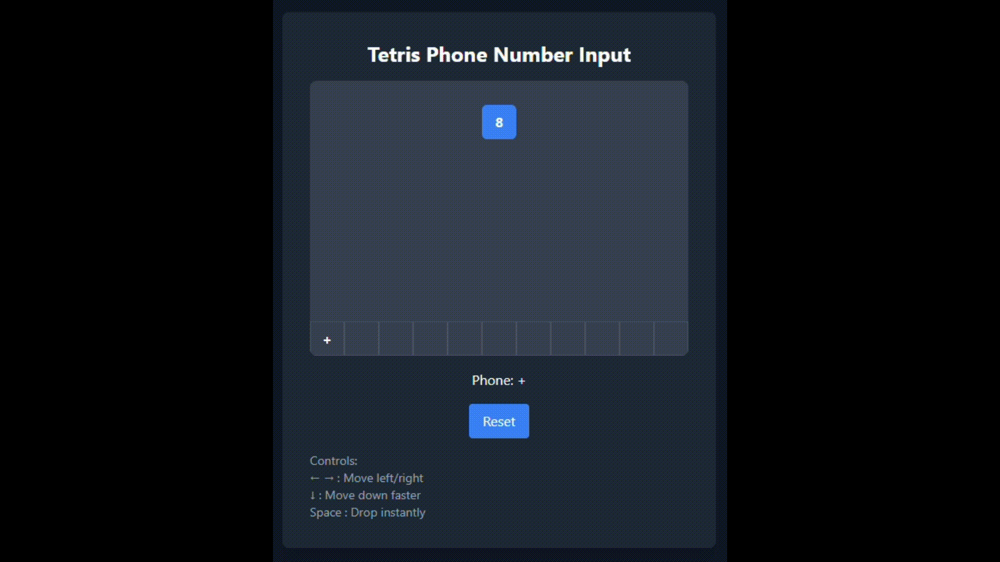

# Tetris Phone Number Input

A unique and entertaining phone number input component inspired by Tetris. This project was created as a contribution to "Bad UI Battles", combining classic Tetris gameplay mechanics with form input functionality.



## 🎮 How It Works

Numbers fall from the top of the screen like Tetris pieces. Users can:

- Move numbers left and right using arrow keys
- Speed up falling with down arrow
- Instantly drop numbers with spacebar
- Build their phone number by positioning falling digits

## 🚀 Features

- Tetris-style gameplay mechanics
- Keyboard controls
- 7-bag randomization system for fair number distribution
- Real-time phone number formation
- Modern UI with Tailwind CSS
- Responsive design

## 🛠️ Technologies Used

- React
- TypeScript
- Tailwind CSS
- Vite

## 🏃‍♂️ Running the Project

1. Clone the repository

```bash
git clone git@github.com:kmertozen/tetris-input.git
```

2. Install dependencies

```bash
npm install
```

3. Run the development server

```bash
npm run dev
```

4. Open http://localhost:5173 in your browser

## 🎮 Controls

- ← → : Move left/right
- ↓ : Move down faster
- Space : Drop instantly

## 🤝 Contributing

Feel free to contribute to this project by creating issues or submitting pull requests.

## 📝 License

This project is licensed under the MIT License - see the [LICENSE](LICENSE) file for details.

---

Note: This project's code and documentation were written using Cursor + Claude.
